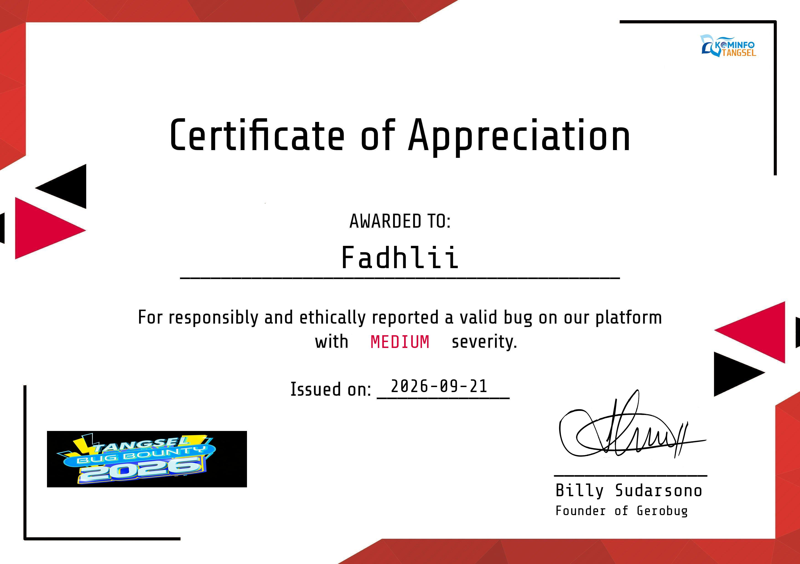
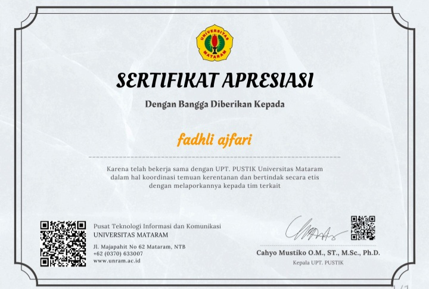

# Hai, saya Fadhli Ajfari

#### i m 19 years old

### Cybersecurity Enthusiast · Bug Hunter · Ethical Reporter

*Menemukan celah, melaporkannya secara etis, dan membantu membuat sistem lebih aman.*

""Portfolio" (https://img.shields.io/badge/Buka_Portfolio-2bff88?style=for-the-badge&logo=gnubash&logoColor=black)" (https://elfajree07.github.io/My-Portofolio)

---

## 👨‍💻 Tentang Saya

- 🔍 Tertarik pada **web security**, **vulnerability research**, dan **bug bounty**
- 🤝 Menjunjung tinggi **responsible disclosure**: setiap temuan dilaporkan secara etis kepada pihak terkait
- 🌱 Terus belajar dan mengasah kemampuan lewat praktik langsung dan CTF
- 📫 Terbuka untuk kolaborasi, diskusi, dan belajar bareng

---

## 🏆 Pencapaian & Sertifikasi

| Tahun | Penghargaan | Penyelenggara | Keterangan |
|:---:|---|---|---|
| 2026 | **Certificate of Appreciation: Tangsel Bug Bounty 2026** | Kominfo Tangsel (Gerobug) | Melaporkan bug valid dengan severity **MEDIUM** secara bertanggung jawab dan etis (21 Sep 2026) |
| - | **Sertifikat of Appreciation: Universitas Mataram** | UPT PUSTIK Universitas Mataram | Bekerja sama dalam koordinasi temuan kerentanan dan melaporkannya secara etis kepada tim terkait |

---

### 📜 Sertifikat Tangsel Bug Bounty 2026

### 📜 Sertifikat Universitas Mataram

## 🛠️ Tools Pentest

---

## 🎯 Fokus Saat Ini

- Web application security
- Menulis laporan bug yang jelas dan mudah direproduksi
- Memperdalam recon dan eksploitasi tingkat lanjut

---

## 📊 GitHub Stats

---

## 📫 Hubungi Saya

---

*"Hack ethically, report responsibly."* 🔐

